# Evaluation 

## Alpha Analysis

### WCv1

#### Mid alpha
Mid alpha is the middle alpha between the `from_alpha` and `to_alpha`. This is computed for each
file which has an optimal alpha.

|fsid| Original Case | Title Case |
|:---:|:---:|:---:|
|  1  |    |  |
|  2  |    |  |
|  3  |   |  |
|  4  |    | 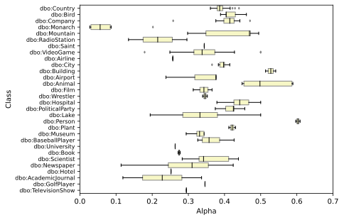 |
|  5  |   |  |

#### Alpha ranges
|fsid| Original Case | Title Case |
|:---:|:---:|:---:|
|  1  |    |  |
|  2  |    |  |
|  3  |   |  |
|  4  |    |  |
|  5  |   |  |

### WCv2

#### Mid alpha
Mid alpha is the middle alpha between the `from_alpha` and `to_alpha`. This is computed for each
file which has an optimal alpha.

|fsid| Original Case | Title Case |
|:---:|:---:|:---:|
|  1  |    | 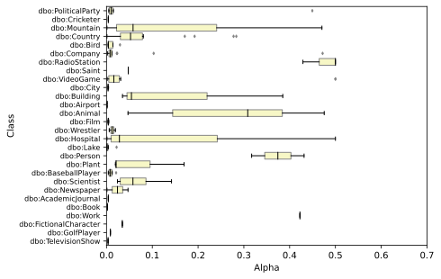 |
|  2  |    |  |
|  3  |   |  |
|  4  |    |  |
|  5  |   |  |

#### Alpha ranges
|fsid| Original Case | Title Case |
|:---:|:---:|:---:|
|  1  |    |  |
|  2  |    |  |
|  3  |   |  |
|  4  |    |  |
|  5  |   |  |

## Alpha k-fold

### T2Dv1
|fsid| Original Case | Title Case |
|:---:|:---:|:---:|
|  1  |    | 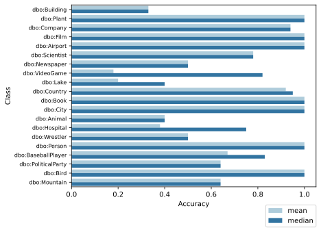 |
|  2  |    |  |
|  3  |   |  |
|  4  |    |  |
|  5  |   |  |

### T2Dv2
|fsid| Original Case | Title Case |
|:---:|:---:|:---:|
|  1  |    | 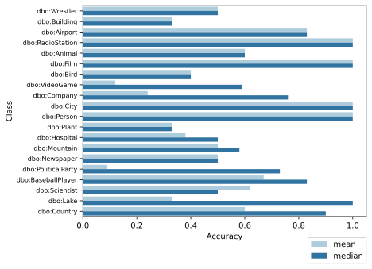 |
|  2  |    | 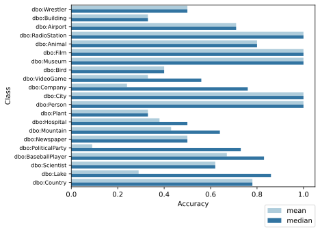 |
|  3  |   | 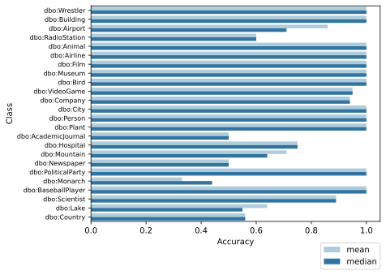 |
|  4  |  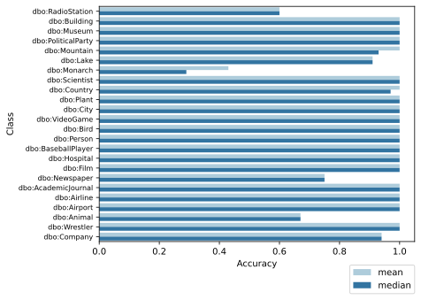  |  |
|  5  |   |  |

## One alpha for all

### T2Dv1
|fsid| Original Case | Title Case |
|:---:|:---:|:---:|
|  1  |    |  |
|  2  |    | 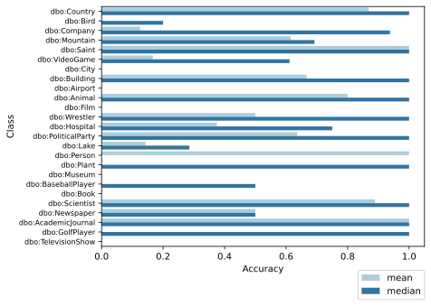 |
|  3  |   | 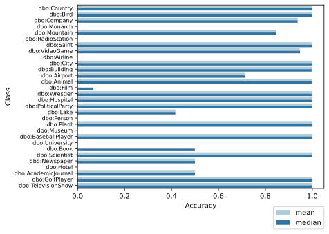 |
|  4  |    |  |
|  5  | 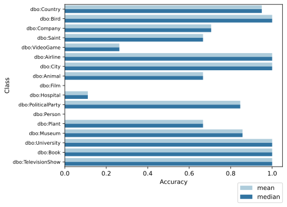  | 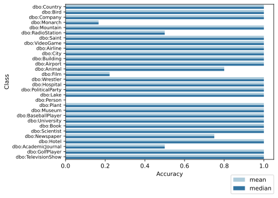 |

### T2Dv2
|fsid| Original Case | Title Case |
|:---:|:---:|:---:|
|  1  |    |  |
|  2  |  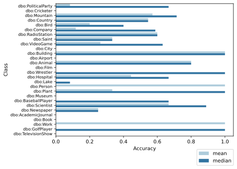  |  |
|  3  |   |  |
|  4  |    | 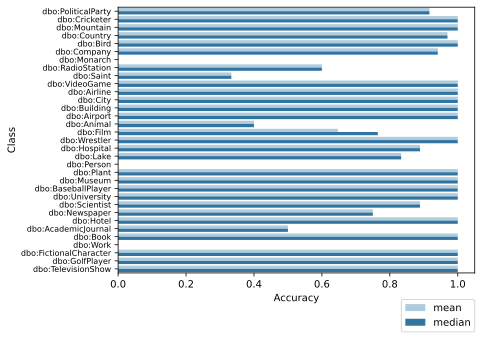 |
|  5  |   |  |

## Conditional Pair

### T2Dv1
#### Using alpha max
|fsid| Original Case | Title Case |
|:---:|:---:|:---:|
|  1  |    |  |
|  2  |    |  |
|  3  |   |  |
|  4  |    |  |
|  5  |   |  |

#### Using alpha mix
|fsid| Original Case | Title Case |
|:---:|:---:|:---:|
|  1  |    |  |
|  2  |    | 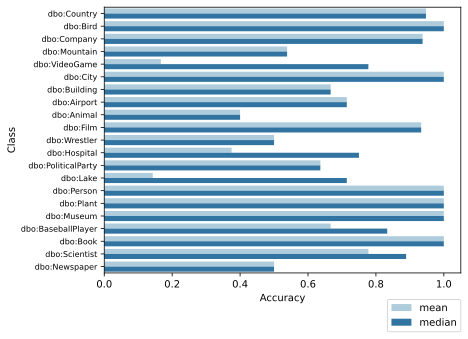 |
|  3  |   |  |
|  4  |    |  |
|  5  |   |  |

### T2Dv2
|fsid| Original Case | Title Case |
|:---:|:---:|:---:|
|  1  |    |  |
|  2  |    |  |
|  3  |   |  |
|  4  |    |  |
|  5  |   |  |

## Error Analysis of alphas prediction of leave one out per class

### Alpha range distances
The average alpha ranges (distances) per specificity function averaged (or aggregated using the median) among all the classes.

#### T2Dv1

 Title case

|fsid| range mean| range median |
|:---:|:---:|:---:|
| 1 | 0.172400 | 0.045500 |
| 2 | 0.176548 | 0.052500 |
| 3 | 0.173480 | 0.148000 |
| 4 | 0.120600 | 0.100500 |
| 5 | **0.097360** | 0.076500 |

 Original case

|fsid	|range mean	| range median	|
|:---:|:---:|:---:|
|1	| 0.271115	|0.330500	|
|2	| 0.266923	|0.328000	|
|3	| 0.188500	|0.219000	|
|4	| 0.110269	|0.115500	|
|5	| **0.093833**	|0.091750	|

#### T2Dv2

 Title case

|fsid| Alpha range mean| Alpha range median |
|:---:|:---:|:---:|
| 1 | 0.201175 | 0.116250
| 2 | 0.203690| 0.083500
| 3 | 0.215792| 0.199000
| 4 | 0.144479| 0.107500
| 5 | **0.114563** |0.095750

Original case

|fsid	|range mean	| range median	|
|:---:|:---:|:---:|
|1	| 0.201225	|0.116250	|
|2	| 0.203690	|0.080000	|
|3	| 0.209042	|0.179750	|
|4	| 0.139312	|0.102250	|
|5	| **0.114696**	|0.094500	|

### One alpha distance (standard deviation)
The distance between the mid alpha for each class and the mean (or the median) of all the mid alphas for the same specificity function

#### T2Dv1

Title case

|fsid	|diff mean	| diff median	|
|:---:|:---:|:---:|
|1	|0.062396	|0.017750	|
|2	|0.059648	|0.032625	|
|3	|0.095308	|0.098625	|
|4	|0.102935	|0.052250	|
|5	|0.092330	|0.036250	|

Original case

|fsid	|diff mean	| diff median	|
|:---:|:---:|:---:|
|1	|0.063515	|0.034500	|
|2	|0.051350	|0.057500	|
|3	|0.047817	|0.055875	|
|4	|0.037179	|0.033500	|
|5	|0.038711	|0.032375	|

#### T2Dv2

Title case

|fsid	|distance mean	| distance median	|
|:---:|:---:|:---:|
|1	|0.047420	|0.024250	|
|2	|0.046354	|0.029000	|
|3	|0.037642	|0.070500	|
|4	|0.029105	|0.019750	|
|5	|0.015146	|0.009250	|

Original case

|fsid	|distance mean	| distance median	|
|:---:|:---:|:---:|
|1	|0.047394	|0.024125	|
|2	|0.046380	|0.029000	|
|3	|0.040749	|0.070500	|
|4	|0.031604	|0.020000	|
|5	|0.020972	|0.009250	|

### One alpha vs class alpha
Comparing the optimal alpha (computed from the mean or median of the mid ranges of the optimal ranges of the files belonging to that class) with the predicted alpha (using one-class-alpha-out cross-validation)

#### T2Dv1 

|fsid| Original Case | Title Case |
|:---:|:---:|:---:|
|  1  |    |  |
|  2  |    |  |
|  3  |   |  |
|  4  |    |  |
|  5  |   |  |

##### Title class

|fsid	|class	|alpha mean	|mean alpha used	|alpha median	|median alpha used	|
|:---:|:---:|:---:|:---:|:---:|:---:|
|1	|dbo:Country	|0.040961	|0.084420	|0.040000	|0.012250	|
|1	|dbo:Bird	|0.006400	|0.085923	|0.004500	|0.015500	|
|1	|dbo:Company	|0.012781	|0.085646	|0.011500	|0.015500	|
|1	|dbo:Mountain	|0.149364	|0.079707	|0.181000	|0.012250	|
|1	|dbo:Saint	|0.044000	|0.084288	|0.044000	|0.012250	|
|1	|dbo:VideoGame	|0.089735	|0.082300	|0.009000	|0.015500	|
|1	|dbo:City	|0.004111	|0.086023	|0.004000	|0.015500	|
|1	|dbo:Building	|0.105167	|0.081629	|0.054500	|0.012250	|
|1	|dbo:Airport	|0.001500	|0.086136	|0.001500	|0.015500	|
|1	|dbo:Animal	|0.208100	|0.077153	|0.048000	|0.012250	|
|1	|dbo:Film	|0.003893	|0.086032	|0.004000	|0.015500	|
|1	|dbo:Wrestler	|0.017500	|0.085440	|0.017500	|0.012250	|
|1	|dbo:Hospital	|0.146562	|0.079829	|0.015500	|0.012250	|
|1	|dbo:PoliticalParty	|0.271000	|0.074419	|0.401500	|0.012250	|
|1	|dbo:Lake	|0.105000	|0.081636	|0.001000	|0.015500	|
|1	|dbo:Person	|0.334250	|0.071669	|0.334250	|0.012250	|
|1	|dbo:Plant	|0.012250	|0.085669	|0.012250	|0.015500	|
|1	|dbo:BaseballPlayer	|0.009583	|0.085785	|0.007750	|0.015500	|
|1	|dbo:Book	|0.003000	|0.086071	|0.003000	|0.015500	|
|1	|dbo:Scientist	|0.055722	|0.083779	|0.037500	|0.012250	|
|1	|dbo:Newspaper	|0.026750	|0.085038	|0.026750	|0.012250	|
|1	|dbo:AcademicJournal	|0.321500	|0.072223	|0.321500	|0.012250	|
|1	|dbo:GolfPlayer	|0.008000	|0.085853	|0.008000	|0.015500	|
|1	|dbo:TelevisionShow	|0.005500	|0.085962	|0.005500	|0.015500	|
|2	|dbo:Country	|0.074434	|0.094746	|0.073750	|0.023125	|
|2	|dbo:Bird	|0.012300	|0.097335	|0.008500	|0.027000	|
|2	|dbo:Company	|0.024563	|0.096824	|0.022250	|0.027000	|
|2	|dbo:Mountain	|0.167000	|0.090889	|0.160000	|0.023125	|
|2	|dbo:Saint	|0.080000	|0.094514	|0.080000	|0.023125	|
|2	|dbo:VideoGame	|0.089972	|0.094099	|0.016500	|0.027000	|
|2	|dbo:City	|0.007944	|0.097517	|0.008000	|0.027000	|
|2	|dbo:Building	|0.154333	|0.091417	|0.098500	|0.023125	|
|2	|dbo:Airport	|0.002071	|0.097761	|0.002500	|0.027000	|
|2	|dbo:Animal	|0.224700	|0.088485	|0.088000	|0.023125	|
|2	|dbo:Film	|0.007067	|0.097553	|0.007500	|0.027000	|
|2	|dbo:Wrestler	|0.033500	|0.096452	|0.033500	|0.023125	|
|2	|dbo:Hospital	|0.161625	|0.091113	|0.030000	|0.023125	|
|2	|dbo:PoliticalParty	|0.275136	|0.086384	|0.401500	|0.023125	|
|2	|dbo:Lake	|0.078500	|0.094577	|0.002000	|0.027000	|
|2	|dbo:Person	|0.413000	|0.080639	|0.413000	|0.023125	|
|2	|dbo:Plant	|0.024000	|0.096848	|0.024000	|0.026125	|
|2	|dbo:Museum	|0.001000	|0.097806	|0.001000	|0.027000	|
|2	|dbo:BaseballPlayer	|0.018333	|0.097084	|0.015250	|0.027000	|
|2	|dbo:Book	|0.005500	|0.097618	|0.005500	|0.027000	|
|2	|dbo:Scientist	|0.097111	|0.093801	|0.069000	|0.023125	|
|2	|dbo:Newspaper	|0.048250	|0.095837	|0.048250	|0.023125	|
|2	|dbo:AcademicJournal	|0.321500	|0.084452	|0.321500	|0.023125	|
|2	|dbo:GolfPlayer	|0.016000	|0.097181	|0.016000	|0.027000	|
|2	|dbo:TelevisionShow	|0.010500	|0.097410	|0.010500	|0.027000	|
|3	|dbo:Country	|0.341645	|0.200605	|0.347750	|0.176500	|
|3	|dbo:Bird	|0.236900	|0.204217	|0.201000	|0.176500	|
|3	|dbo:Company	|0.248219	|0.203827	|0.251500	|0.176500	|
|3	|dbo:Monarch	|0.007875	|0.212115	|0.002250	|0.201000	|
|3	|dbo:Mountain	|0.309962	|0.201698	|0.377500	|0.176500	|
|3	|dbo:RadioStation	|0.030750	|0.211326	|0.030750	|0.201000	|
|3	|dbo:Saint	|0.249500	|0.203783	|0.249500	|0.176500	|
|3	|dbo:VideoGame	|0.212132	|0.205071	|0.176500	|0.201000	|
|3	|dbo:Airline	|0.042000	|0.210938	|0.042000	|0.201000	|
|3	|dbo:City	|0.146500	|0.207335	|0.144000	|0.201000	|
|3	|dbo:Building	|0.427167	|0.197656	|0.444000	|0.176500	|
|3	|dbo:Airport	|0.110214	|0.208586	|0.132500	|0.201000	|
|3	|dbo:Animal	|0.404600	|0.198435	|0.371000	|0.176500	|
|3	|dbo:Film	|0.103833	|0.208806	|0.101500	|0.201000	|
|3	|dbo:Wrestler	|0.223250	|0.204688	|0.223250	|0.176500	|
|3	|dbo:Hospital	|0.369688	|0.199638	|0.373750	|0.176500	|
|3	|dbo:PoliticalParty	|0.361500	|0.199921	|0.401500	|0.176500	|
|3	|dbo:Lake	|0.134375	|0.207753	|0.086250	|0.201000	|
|3	|dbo:Person	|0.541750	|0.193705	|0.541750	|0.176500	|
|3	|dbo:Plant	|0.260750	|0.203395	|0.260750	|0.176500	|
|3	|dbo:Museum	|0.070429	|0.209958	|0.073500	|0.201000	|
|3	|dbo:BaseballPlayer	|0.220583	|0.204780	|0.213250	|0.176500	|
|3	|dbo:University	|0.059500	|0.210335	|0.059500	|0.201000	|
|3	|dbo:Book	|0.097250	|0.209033	|0.097250	|0.201000	|
|3	|dbo:Scientist	|0.263333	|0.203306	|0.228000	|0.176500	|
|3	|dbo:Newspaper	|0.141250	|0.207516	|0.084250	|0.201000	|
|3	|dbo:Hotel	|0.039500	|0.211024	|0.039500	|0.201000	|
|3	|dbo:AcademicJournal	|0.164750	|0.206705	|0.164750	|0.201000	|
|3	|dbo:GolfPlayer	|0.221500	|0.204748	|0.221500	|0.176500	|
|3	|dbo:TelevisionShow	|0.118500	|0.208300	|0.118500	|0.201000	|
|4	|dbo:Country	|0.388842	|0.351063	|0.386500	|0.344000	|
|4	|dbo:Bird	|0.417700	|0.350068	|0.404500	|0.344000	|
|4	|dbo:Company	|0.406937	|0.350439	|0.414500	|0.344000	|
|4	|dbo:Monarch	|0.076167	|0.361845	|0.056000	|0.346000	|
|4	|dbo:Mountain	|0.421385	|0.349941	|0.469000	|0.344000	|
|4	|dbo:RadioStation	|0.215250	|0.357049	|0.215250	|0.346000	|
|4	|dbo:Saint	|0.344000	|0.352609	|0.344000	|0.346000	|
|4	|dbo:VideoGame	|0.348263	|0.352462	|0.338000	|0.346000	|
|4	|dbo:Airline	|0.257000	|0.355609	|0.257000	|0.346000	|
|4	|dbo:City	|0.394056	|0.350883	|0.397500	|0.344000	|
|4	|dbo:Building	|0.527667	|0.346276	|0.528000	|0.344000	|
|4	|dbo:Airport	|0.339929	|0.352750	|0.376500	|0.344000	|
|4	|dbo:Animal	|0.515100	|0.346709	|0.498000	|0.344000	|
|4	|dbo:Film	|0.342125	|0.352674	|0.343000	|0.346000	|
|4	|dbo:Wrestler	|0.346000	|0.352540	|0.346000	|0.344000	|
|4	|dbo:Hospital	|0.445437	|0.349112	|0.442000	|0.344000	|
|4	|dbo:PoliticalParty	|0.417500	|0.350075	|0.424500	|0.344000	|
|4	|dbo:Lake	|0.336083	|0.352882	|0.332000	|0.346000	|
|4	|dbo:Person	|0.603000	|0.343678	|0.603000	|0.344000	|
|4	|dbo:Plant	|0.421250	|0.349946	|0.421250	|0.344000	|
|4	|dbo:Museum	|0.328857	|0.353132	|0.331000	|0.346000	|
|4	|dbo:BaseballPlayer	|0.365917	|0.351854	|0.357250	|0.344000	|
|4	|dbo:University	|0.263500	|0.355385	|0.263500	|0.346000	|
|4	|dbo:Book	|0.274500	|0.355006	|0.274500	|0.346000	|
|4	|dbo:Scientist	|0.363333	|0.351943	|0.342000	|0.346000	|
|4	|dbo:Newspaper	|0.289625	|0.354484	|0.310250	|0.346000	|
|4	|dbo:Hotel	|0.252000	|0.355782	|0.252000	|0.346000	|
|4	|dbo:AcademicJournal	|0.227750	|0.356618	|0.227750	|0.346000	|
|4	|dbo:GolfPlayer	|0.346000	|0.352540	|0.346000	|0.344000	|
|4	|dbo:TelevisionShow	|0.294500	|0.354316	|0.294500	|0.346000	|
|5	|dbo:Country	|0.412408	|0.410570	|0.409250	|0.406000	|
|5	|dbo:Bird	|0.456300	|0.409056	|0.454500	|0.406000	|
|5	|dbo:Company	|0.449344	|0.409296	|0.448000	|0.406000	|
|5	|dbo:Monarch	|0.123917	|0.420518	|0.102250	|0.409250	|
|5	|dbo:Mountain	|0.467077	|0.408684	|0.476000	|0.406000	|
|5	|dbo:RadioStation	|0.308750	|0.414144	|0.308750	|0.409250	|
|5	|dbo:Saint	|0.387000	|0.411446	|0.387000	|0.409250	|
|5	|dbo:VideoGame	|0.402132	|0.410924	|0.406000	|0.409250	|
|5	|dbo:Airline	|0.343000	|0.412963	|0.343000	|0.409250	|
|5	|dbo:City	|0.470944	|0.408551	|0.471000	|0.406000	|
|5	|dbo:Building	|0.573833	|0.405003	|0.572000	|0.406000	|
|5	|dbo:Airport	|0.409643	|0.410665	|0.440000	|0.406000	|
|5	|dbo:Animal	|0.566700	|0.405249	|0.550000	|0.406000	|
|5	|dbo:Film	|0.477000	|0.408342	|0.470500	|0.406000	|
|5	|dbo:Wrestler	|0.384500	|0.411532	|0.384500	|0.409250	|
|5	|dbo:Hospital	|0.451750	|0.409213	|0.458000	|0.406000	|
|5	|dbo:PoliticalParty	|0.429545	|0.409979	|0.426000	|0.406000	|
|5	|dbo:Lake	|0.410000	|0.410653	|0.415000	|0.406000	|
|5	|dbo:Person	|0.608000	|0.403825	|0.608000	|0.406000	|
|5	|dbo:Plant	|0.474750	|0.408420	|0.474750	|0.406000	|
|5	|dbo:Museum	|0.398429	|0.411052	|0.401000	|0.409250	|
|5	|dbo:BaseballPlayer	|0.422917	|0.410207	|0.414750	|0.406000	|
|5	|dbo:University	|0.354500	|0.412566	|0.354500	|0.409250	|
|5	|dbo:Book	|0.383750	|0.411558	|0.383750	|0.409250	|
|5	|dbo:Scientist	|0.417111	|0.410407	|0.404500	|0.409250	|
|5	|dbo:Newspaper	|0.341375	|0.413019	|0.375000	|0.409250	|
|5	|dbo:Hotel	|0.330500	|0.413394	|0.330500	|0.409250	|
|5	|dbo:AcademicJournal	|0.275250	|0.415299	|0.275250	|0.409250	|
|5	|dbo:GolfPlayer	|0.393500	|0.411222	|0.393500	|0.409250	|
|5	|dbo:TelevisionShow	|0.395000	|0.411170	|0.395000	|0.409250	|

##### Original case

|fsid	|class	|alpha mean	|mean alpha used	|alpha median	|median alpha used	|
|:---:|:---:|:---:|:---:|:---:|:---:|
|1	|dbo:Country	|0.113882	|0.178212	|0.050000	|0.082500	|
|1	|dbo:Bird	|0.006100	|0.184553	|0.004000	|0.082500	|
|1	|dbo:Company	|0.072533	|0.180645	|0.013500	|0.082500	|
|1	|dbo:Saint	|0.082500	|0.180058	|0.082500	|0.058500	|
|1	|dbo:VideoGame	|0.286200	|0.168076	|0.286000	|0.058500	|
|1	|dbo:Airline	|0.021500	|0.183647	|0.021500	|0.082500	|
|1	|dbo:City	|0.004667	|0.184637	|0.003500	|0.082500	|
|1	|dbo:Building	|0.004000	|0.184676	|0.004000	|0.082500	|
|1	|dbo:Animal	|0.212600	|0.172406	|0.058500	|0.082500	|
|1	|dbo:Film	|0.027167	|0.183313	|0.018000	|0.082500	|
|1	|dbo:Hospital	|0.400000	|0.161382	|0.400000	|0.058500	|
|1	|dbo:PoliticalParty	|0.383045	|0.162379	|0.407000	|0.058500	|
|1	|dbo:Person	|0.517500	|0.154470	|0.517500	|0.058500	|
|1	|dbo:Plant	|0.256000	|0.169853	|0.256000	|0.058500	|
|1	|dbo:Museum	|0.100800	|0.178982	|0.001000	|0.082500	|
|1	|dbo:University	|0.375000	|0.162853	|0.375000	|0.058500	|
|1	|dbo:Book	|0.152500	|0.175941	|0.152500	|0.058500	|
|1	|dbo:TelevisionShow	|0.127500	|0.177411	|0.127500	|0.058500	|
|2	|dbo:Country	|0.145921	|0.192639	|0.090500	|0.140500	|
|2	|dbo:Bird	|0.011800	|0.200528	|0.008000	|0.140500	|
|2	|dbo:Company	|0.081233	|0.196444	|0.025500	|0.140500	|
|2	|dbo:Saint	|0.140500	|0.192957	|0.140500	|0.105500	|
|2	|dbo:VideoGame	|0.307700	|0.183122	|0.286000	|0.105500	|
|2	|dbo:Airline	|0.040500	|0.198840	|0.040500	|0.140500	|
|2	|dbo:City	|0.009167	|0.200683	|0.007000	|0.140500	|
|2	|dbo:Building	|0.008000	|0.200752	|0.008000	|0.140500	|
|2	|dbo:Animal	|0.231000	|0.187634	|0.105500	|0.140500	|
|2	|dbo:Film	|0.050500	|0.198252	|0.034000	|0.140500	|
|2	|dbo:Hospital	|0.400000	|0.177693	|0.400000	|0.105500	|
|2	|dbo:PoliticalParty	|0.383455	|0.178666	|0.407000	|0.105500	|
|2	|dbo:Person	|0.534000	|0.169810	|0.534000	|0.105500	|
|2	|dbo:Plant	|0.261500	|0.185840	|0.261500	|0.105500	|
|2	|dbo:Museum	|0.084500	|0.196252	|0.001500	|0.140500	|
|2	|dbo:University	|0.375000	|0.179163	|0.375000	|0.105500	|
|2	|dbo:Book	|0.153000	|0.192222	|0.153000	|0.105500	|
|2	|dbo:TelevisionShow	|0.203000	|0.189281	|0.203000	|0.105500	|
|3	|dbo:Country	|0.378158	|0.320545	|0.381750	|0.297000	|
|3	|dbo:Bird	|0.232700	|0.329102	|0.198000	|0.303500	|
|3	|dbo:Company	|0.258100	|0.327607	|0.270000	|0.303500	|
|3	|dbo:Saint	|0.297000	|0.325319	|0.297000	|0.303500	|
|3	|dbo:VideoGame	|0.372700	|0.320866	|0.296500	|0.303500	|
|3	|dbo:Airline	|0.303500	|0.324937	|0.303500	|0.297000	|
|3	|dbo:City	|0.149167	|0.334015	|0.132000	|0.303500	|
|3	|dbo:Building	|0.227000	|0.329437	|0.227000	|0.303500	|
|3	|dbo:Animal	|0.405700	|0.318925	|0.375000	|0.297000	|
|3	|dbo:Film	|0.319833	|0.323976	|0.317500	|0.297000	|
|3	|dbo:Hospital	|0.400000	|0.319260	|0.400000	|0.297000	|
|3	|dbo:PoliticalParty	|0.396318	|0.319477	|0.407000	|0.297000	|
|3	|dbo:Person	|0.638000	|0.305260	|0.638000	|0.297000	|
|3	|dbo:Plant	|0.378000	|0.320554	|0.378000	|0.297000	|
|3	|dbo:Museum	|0.184250	|0.331952	|0.128000	|0.303500	|
|3	|dbo:University	|0.375000	|0.320731	|0.375000	|0.297000	|
|3	|dbo:Book	|0.230500	|0.329231	|0.230500	|0.303500	|
|3	|dbo:TelevisionShow	|0.281500	|0.326231	|0.281500	|0.303500	|
|4	|dbo:Country	|0.453829	|0.419235	|0.460000	|0.385125	|
|4	|dbo:Bird	|0.411600	|0.421874	|0.394500	|0.385125	|
|4	|dbo:Company	|0.389214	|0.423273	|0.385750	|0.389500	|
|4	|dbo:Saint	|0.327500	|0.427130	|0.327500	|0.390125	|
|4	|dbo:VideoGame	|0.403900	|0.422355	|0.368000	|0.390125	|
|4	|dbo:Airline	|0.320500	|0.427568	|0.320500	|0.390125	|
|4	|dbo:City	|0.347667	|0.425870	|0.330000	|0.390125	|
|4	|dbo:Animal	|0.518700	|0.415180	|0.501500	|0.385125	|
|4	|dbo:Film	|0.523750	|0.414865	|0.523750	|0.385125	|
|4	|dbo:Hospital	|0.399000	|0.422662	|0.399000	|0.385125	|
|4	|dbo:PoliticalParty	|0.414091	|0.421718	|0.409000	|0.385125	|
|4	|dbo:Person	|0.730000	|0.401974	|0.730000	|0.385125	|
|4	|dbo:Plant	|0.467750	|0.418365	|0.467750	|0.385125	|
|4	|dbo:Museum	|0.338583	|0.426438	|0.294000	|0.390125	|
|4	|dbo:University	|0.371500	|0.424380	|0.371500	|0.390125	|
|4	|dbo:Book	|0.359500	|0.425130	|0.359500	|0.390125	|
|4	|dbo:TelevisionShow	|0.384500	|0.423568	|0.384500	|0.390125	|
|5	|dbo:Country	|0.468711	|0.451286	|0.473750	|0.422500	|
|5	|dbo:Bird	|0.446800	|0.452655	|0.436000	|0.422500	|
|5	|dbo:Company	|0.406167	|0.455195	|0.423000	|0.428500	|
|5	|dbo:Saint	|0.354500	|0.458424	|0.354500	|0.429000	|
|5	|dbo:VideoGame	|0.427800	|0.453843	|0.422000	|0.429000	|
|5	|dbo:Airline	|0.337000	|0.459518	|0.337000	|0.429000	|
|5	|dbo:City	|0.436222	|0.453316	|0.435000	|0.422500	|
|5	|dbo:Animal	|0.570500	|0.444924	|0.553500	|0.422500	|
|5	|dbo:Film	|0.571500	|0.444861	|0.571500	|0.422500	|
|5	|dbo:Hospital	|0.398000	|0.455705	|0.398000	|0.429000	|
|5	|dbo:PoliticalParty	|0.419500	|0.454361	|0.411000	|0.429000	|
|5	|dbo:Person	|0.784500	|0.431549	|0.784500	|0.422500	|
|5	|dbo:Plant	|0.502750	|0.449158	|0.502750	|0.422500	|
|5	|dbo:Museum	|0.342333	|0.459184	|0.292000	|0.429000	|
|5	|dbo:University	|0.368000	|0.457580	|0.368000	|0.429000	|
|5	|dbo:Book	|0.406500	|0.455174	|0.406500	|0.429000	|
|5	|dbo:TelevisionShow	|0.448500	|0.452549	|0.448500	|0.422500	|

#### T2Dv2 

|fsid| Original Case | Title Case |
|:---:|:---:|:---:|
|  1  |    |  |
|  2  |    |  |
|  3  |   |  |
|  4  |    |  |
|  5  |   |  |

## Accuracy of One alpha for all verses conditional pair method

#### Accuracy for One alpha method

|fsid	|accuracy of mean	|accuracy of median|
|:---:|:---:|:---:|
1	|0.314629	|0.564188
2	|0.371410	|0.579065
3	|0.628732	|0.647621
4	|0.876667	|0.882222
5	|0.864630	|0.864630

#### Accuracy using the Conditional Pair method

##### Using max

|fsid	|accuracy of mean	|accuracy of median|
|:---:|:---:|:---:|
1	|0.561360	|0.623778
2	|0.557548	|0.631716
3	|0.664133	|0.698133
4	|0.883173	|0.885278
5	|0.896667	|0.888667

##### Using min

|fsid	|accuracy of mean	|accuracy of median|
|:---:|:---:|:---:|
1	|1.000000	|1.000000
2	|1.000000	|1.000000
3	|1.000000	|1.000000
4	|1.000000	|1.000000
5	|0.000000	|0.000000

## SemTab 2019

*In these tests, ok and perfect annotations are treated as perfect*

|| Original Case | Title Case |
|:-------------------------:|:-------------------------:|:-------------------------:|
|Round 2|||
|Round 3|||
|Round 4|||

|round|case    |fs |k  |precision|recall|f1  |
|-----|--------|---|---|---------|------|----|
|2    |original|1  |1  |0.83     |0.85  |0.84|
|2    |original|2  |1  |0.83     |0.85  |0.84|
|2    |original|3  |1  |0.83     |0.85  |0.84|
|2    |original|4  |1  |0.81     |0.85  |0.83|
|2    |original|5  |1  |0.77     |0.84  |0.81|
|2    |original|1  |3  |0.88     |0.86  |0.87|
|2    |original|2  |3  |0.88     |0.86  |0.87|
|2    |original|3  |3  |0.88     |0.86  |0.87|
|2    |original|4  |3  |0.88     |0.86  |0.87|
|2    |original|5  |3  |0.88     |0.86  |0.87|
|2    |original|1  |5  |0.90     |0.86  |0.88|
|2    |original|2  |5  |0.90     |0.86  |0.88|
|2    |original|3  |5  |0.90     |0.86  |0.88|
|2    |original|4  |5  |0.90     |0.86  |0.88|
|2    |original|5  |5  |0.90     |0.86  |0.88|
|2    |title   |1  |1  |0.83     |0.85  |0.84|
|2    |title   |2  |1  |0.83     |0.85  |0.84|
|2    |title   |3  |1  |0.83     |0.85  |0.84|
|2    |title   |4  |1  |0.81     |0.85  |0.83|
|2    |title   |5  |1  |0.77     |0.84  |0.81|
|2    |title   |1  |3  |0.88     |0.86  |0.87|
|2    |title   |2  |3  |0.88     |0.86  |0.87|
|2    |title   |3  |3  |0.88     |0.86  |0.87|
|2    |title   |4  |3  |0.88     |0.86  |0.87|
|2    |title   |5  |3  |0.88     |0.86  |0.87|
|2    |title   |1  |5  |0.90     |0.86  |0.88|
|2    |title   |2  |5  |0.90     |0.86  |0.88|
|2    |title   |3  |5  |0.90     |0.86  |0.88|
|2    |title   |4  |5  |0.90     |0.86  |0.88|
|2    |title   |5  |5  |0.90     |0.86  |0.88|
|3    |original|1  |1  |0.95     |0.98  |0.97|
|3    |original|2  |1  |0.96     |0.98  |0.97|
|3    |original|3  |1  |0.95     |0.98  |0.97|
|3    |original|4  |1  |0.93     |0.98  |0.95|
|3    |original|5  |1  |0.89     |0.98  |0.94|
|3    |original|1  |3  |0.99     |0.98  |0.99|
|3    |original|2  |3  |0.99     |0.98  |0.99|
|3    |original|3  |3  |0.99     |0.98  |0.99|
|3    |original|4  |3  |0.99     |0.98  |0.99|
|3    |original|5  |3  |0.99     |0.98  |0.99|
|3    |original|1  |5  |0.99     |0.98  |0.99|
|3    |original|2  |5  |0.99     |0.98  |0.99|
|3    |original|3  |5  |0.99     |0.98  |0.99|
|3    |original|4  |5  |0.99     |0.98  |0.99|
|3    |original|5  |5  |0.99     |0.98  |0.99|
|3    |title   |1  |1  |0.95     |0.98  |0.97|
|3    |title   |2  |1  |0.96     |0.98  |0.97|
|3    |title   |3  |1  |0.95     |0.98  |0.97|
|3    |title   |4  |1  |0.93     |0.98  |0.95|
|3    |title   |5  |1  |0.89     |0.98  |0.94|
|3    |title   |1  |3  |0.99     |0.98  |0.99|
|3    |title   |2  |3  |0.99     |0.98  |0.99|
|3    |title   |3  |3  |0.99     |0.98  |0.99|
|3    |title   |4  |3  |0.99     |0.98  |0.99|
|3    |title   |5  |3  |0.99     |0.98  |0.99|
|3    |title   |1  |5  |0.99     |0.98  |0.99|
|3    |title   |2  |5  |0.99     |0.98  |0.99|
|3    |title   |3  |5  |0.99     |0.98  |0.99|
|3    |title   |4  |5  |0.99     |0.98  |0.99|
|3    |title   |5  |5  |0.99     |0.98  |0.99|
|4    |original|1  |1  |0.96     |0.98  |0.97|
|4    |original|2  |1  |0.96     |0.98  |0.97|
|4    |original|3  |1  |0.95     |0.98  |0.97|
|4    |original|4  |1  |0.95     |0.98  |0.96|
|4    |original|5  |1  |0.92     |0.98  |0.95|
|4    |original|1  |3  |0.99     |0.98  |0.98|
|4    |original|2  |3  |0.99     |0.98  |0.98|
|4    |original|3  |3  |1.0      |0.98  |0.99|
|4    |original|4  |3  |1.0      |0.98  |0.99|
|4    |original|5  |3  |1.0      |0.98  |0.99|
|4    |original|1  |5  |1.0      |0.98  |0.99|
|4    |original|2  |5  |1.0      |0.98  |0.99|
|4    |original|3  |5  |1.0      |0.98  |0.99|
|4    |original|4  |5  |1.0      |0.98  |0.99|
|4    |original|5  |5  |1.0      |0.98  |0.99|
|4    |title   |1  |1  |0.96     |0.98  |0.97|
|4    |title   |2  |1  |0.96     |0.98  |0.97|
|4    |title   |3  |1  |0.95     |0.98  |0.97|
|4    |title   |4  |1  |0.95     |0.98  |0.96|
|4    |title   |5  |1  |0.92     |0.98  |0.95|
|4    |title   |1  |3  |0.99     |0.98  |0.98|
|4    |title   |2  |3  |0.99     |0.98  |0.98|
|4    |title   |3  |3  |1.0      |0.98  |0.99|
|4    |title   |4  |3  |1.0      |0.98  |0.99|
|4    |title   |5  |3  |1.0      |0.98  |0.99|
|4    |title   |1  |5  |1.0      |0.98  |0.99|
|4    |title   |2  |5  |1.0      |0.98  |0.99|
|4    |title   |3  |5  |1.0      |0.98  |0.99|
|4    |title   |4  |5  |1.0      |0.98  |0.99|
|4    |title   |5  |5  |1.0      |0.98  |0.99|

### Errors 
* Round 2: Files with parsing errors: `384`
* Round 3: Files with parsing errors: `0`
* Round 4: Files with parsing errors: `0`

