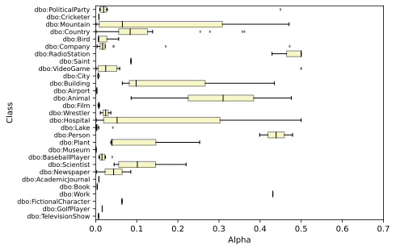
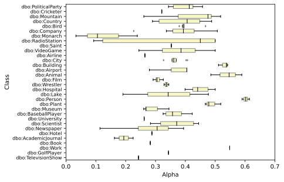
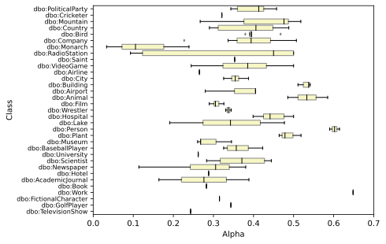
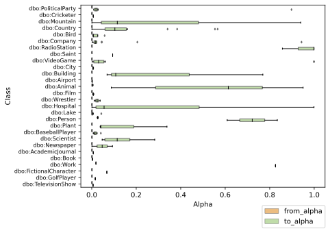
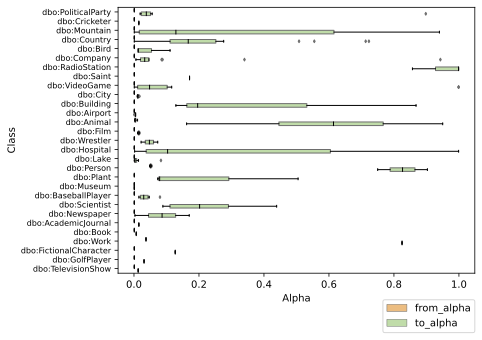
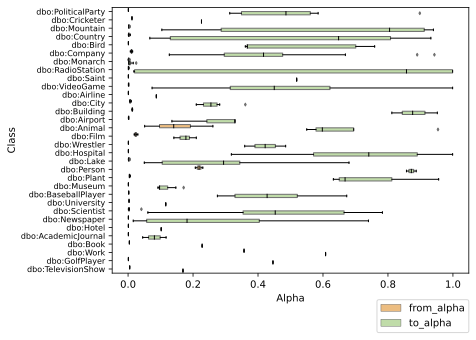

# Evaluation 

## Alpha Analysis
### Mid alpha
Mid alpha is the middle alpha between the `from_alpha` and `to_alpha`. This is computed for each
file which has an optimal alpha.

|fsid| Original Case | Title Case |
|:---:|:---:|:---:|
|  1  |    |  |
|  2  |    |  |
|  3  |   |  |
|  4  |    |  |
|  5  |   |  |

### Alpha ranges
|fsid| Original Case | Title Case |
|:---:|:---:|:---:|
|  1  |    |  |
|  2  |    |  |
|  3  |   |  |
|  4  |    |  |
|  5  |   |  |

## SemTab 2019

*In these tests, ok and perfect annotations are treated as perfect*

|| Original Case | Title Case |
|:-------------------------:|:-------------------------:|:-------------------------:|
|Round 2|||
|Round 3|||
|Round 4|||

|round|case    |fs |k  |precision|recall|f1  |
|-----|--------|---|---|---------|------|----|
|2    |original|1  |1  |0.83     |0.85  |0.84|
|2    |original|2  |1  |0.83     |0.85  |0.84|
|2    |original|3  |1  |0.83     |0.85  |0.84|
|2    |original|4  |1  |0.81     |0.85  |0.83|
|2    |original|5  |1  |0.77     |0.84  |0.81|
|2    |original|1  |3  |0.88     |0.86  |0.87|
|2    |original|2  |3  |0.88     |0.86  |0.87|
|2    |original|3  |3  |0.88     |0.86  |0.87|
|2    |original|4  |3  |0.88     |0.86  |0.87|
|2    |original|5  |3  |0.88     |0.86  |0.87|
|2    |original|1  |5  |0.90     |0.86  |0.88|
|2    |original|2  |5  |0.90     |0.86  |0.88|
|2    |original|3  |5  |0.90     |0.86  |0.88|
|2    |original|4  |5  |0.90     |0.86  |0.88|
|2    |original|5  |5  |0.90     |0.86  |0.88|
|2    |title   |1  |1  |0.83     |0.85  |0.84|
|2    |title   |2  |1  |0.83     |0.85  |0.84|
|2    |title   |3  |1  |0.83     |0.85  |0.84|
|2    |title   |4  |1  |0.81     |0.85  |0.83|
|2    |title   |5  |1  |0.77     |0.84  |0.81|
|2    |title   |1  |3  |0.88     |0.86  |0.87|
|2    |title   |2  |3  |0.88     |0.86  |0.87|
|2    |title   |3  |3  |0.88     |0.86  |0.87|
|2    |title   |4  |3  |0.88     |0.86  |0.87|
|2    |title   |5  |3  |0.88     |0.86  |0.87|
|2    |title   |1  |5  |0.90     |0.86  |0.88|
|2    |title   |2  |5  |0.90     |0.86  |0.88|
|2    |title   |3  |5  |0.90     |0.86  |0.88|
|2    |title   |4  |5  |0.90     |0.86  |0.88|
|2    |title   |5  |5  |0.90     |0.86  |0.88|
|3    |original|1  |1  |0.95     |0.98  |0.97|
|3    |original|2  |1  |0.96     |0.98  |0.97|
|3    |original|3  |1  |0.95     |0.98  |0.97|
|3    |original|4  |1  |0.93     |0.98  |0.95|
|3    |original|5  |1  |0.89     |0.98  |0.94|
|3    |original|1  |3  |0.99     |0.98  |0.99|
|3    |original|2  |3  |0.99     |0.98  |0.99|
|3    |original|3  |3  |0.99     |0.98  |0.99|
|3    |original|4  |3  |0.99     |0.98  |0.99|
|3    |original|5  |3  |0.99     |0.98  |0.99|
|3    |original|1  |5  |0.99     |0.98  |0.99|
|3    |original|2  |5  |0.99     |0.98  |0.99|
|3    |original|3  |5  |0.99     |0.98  |0.99|
|3    |original|4  |5  |0.99     |0.98  |0.99|
|3    |original|5  |5  |0.99     |0.98  |0.99|
|3    |title   |1  |1  |0.95     |0.98  |0.97|
|3    |title   |2  |1  |0.96     |0.98  |0.97|
|3    |title   |3  |1  |0.95     |0.98  |0.97|
|3    |title   |4  |1  |0.93     |0.98  |0.95|
|3    |title   |5  |1  |0.89     |0.98  |0.94|
|3    |title   |1  |3  |0.99     |0.98  |0.99|
|3    |title   |2  |3  |0.99     |0.98  |0.99|
|3    |title   |3  |3  |0.99     |0.98  |0.99|
|3    |title   |4  |3  |0.99     |0.98  |0.99|
|3    |title   |5  |3  |0.99     |0.98  |0.99|
|3    |title   |1  |5  |0.99     |0.98  |0.99|
|3    |title   |2  |5  |0.99     |0.98  |0.99|
|3    |title   |3  |5  |0.99     |0.98  |0.99|
|3    |title   |4  |5  |0.99     |0.98  |0.99|
|3    |title   |5  |5  |0.99     |0.98  |0.99|
|4    |original|1  |1  |0.96     |0.98  |0.97|
|4    |original|2  |1  |0.96     |0.98  |0.97|
|4    |original|3  |1  |0.95     |0.98  |0.97|
|4    |original|4  |1  |0.95     |0.98  |0.96|
|4    |original|5  |1  |0.92     |0.98  |0.95|
|4    |original|1  |3  |0.99     |0.98  |0.98|
|4    |original|2  |3  |0.99     |0.98  |0.98|
|4    |original|3  |3  |1.0      |0.98  |0.99|
|4    |original|4  |3  |1.0      |0.98  |0.99|
|4    |original|5  |3  |1.0      |0.98  |0.99|
|4    |original|1  |5  |1.0      |0.98  |0.99|
|4    |original|2  |5  |1.0      |0.98  |0.99|
|4    |original|3  |5  |1.0      |0.98  |0.99|
|4    |original|4  |5  |1.0      |0.98  |0.99|
|4    |original|5  |5  |1.0      |0.98  |0.99|
|4    |title   |1  |1  |0.96     |0.98  |0.97|
|4    |title   |2  |1  |0.96     |0.98  |0.97|
|4    |title   |3  |1  |0.95     |0.98  |0.97|
|4    |title   |4  |1  |0.95     |0.98  |0.96|
|4    |title   |5  |1  |0.92     |0.98  |0.95|
|4    |title   |1  |3  |0.99     |0.98  |0.98|
|4    |title   |2  |3  |0.99     |0.98  |0.98|
|4    |title   |3  |3  |1.0      |0.98  |0.99|
|4    |title   |4  |3  |1.0      |0.98  |0.99|
|4    |title   |5  |3  |1.0      |0.98  |0.99|
|4    |title   |1  |5  |1.0      |0.98  |0.99|
|4    |title   |2  |5  |1.0      |0.98  |0.99|
|4    |title   |3  |5  |1.0      |0.98  |0.99|
|4    |title   |4  |5  |1.0      |0.98  |0.99|
|4    |title   |5  |5  |1.0      |0.98  |0.99|

### Errors 
* Round 2: Files with parsing errors: `384`
* Round 3: Files with parsing errors: `0`
* Round 4: Files with parsing errors: `0`

